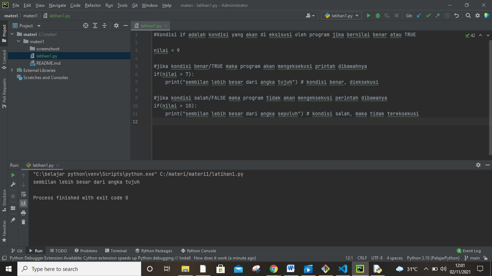
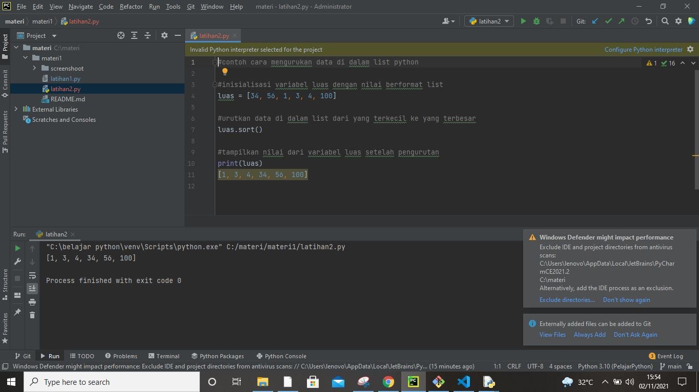
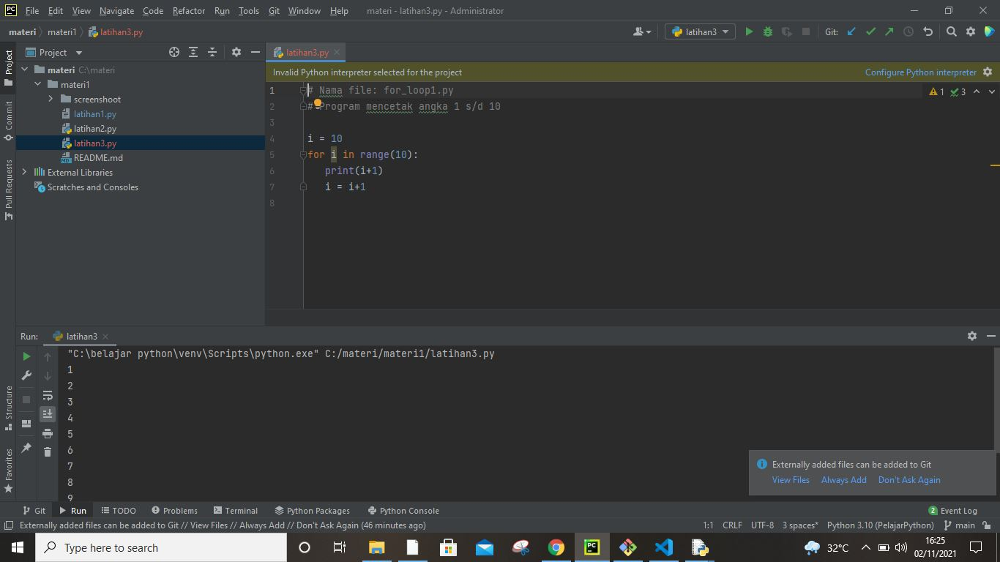

# materi1
## latihan membuat program sederhana 
### berikut programnnya
kita menggunakan pycram untuk editornnya

1.latihan1'
'
codingannya
#Kondisi if adalah kondisi yang akan di eksisusi oleh program jika bernilai benar atau TRUE

nilai = 9

#jika kondisi benar/TRUE maka program akan mengeksekusi printah dibawahnya
if(nilai > 7):
    print("sembilan lebih besar dari angka tujuh") # kondisi benar, dieksekusi

#jika kondisi salah/FALSE maka program tidak akan mengeksekusi perintah dibawanya
if(nilai > 10):
    print("sembilan lebih besar dari angka sepuluh") # kondisi salah, maka tidak tereksekusi
 Ini contoh codingannya'
'
 

 Berikut hasil run scripnnya
 "C:\belajar python\venv\Scripts\python.exe" C:/materi/materi1/latihan1.py
sembilan lebih besar dari angka tujuh

Process finished with exit code 0'
'
2. Latihan 2'
'
misi kita adalah mengurutkan data yang ada pada array list variabel luas dari urutan acak menjadi urruan dari nilai terkecil ke terbesar.

Untuk itu kita bisa gunakan fungsi sort(), dengan menggunakan kode program luas.sort(). Tidak perlu ada parameter yang kita tulis dalam fungsi sort(). 

Setelah itu kita ingin buktikan, kita coba tampilkan hasil dari pengurutan tersebut menggunakan fungsi print().

Setelah ditampilkan kita bisa lihat bahwa data di dalam array list python kini sudah terurut dari nilai terkecil ke nilai terbesar.'
'

3. Latihan 3 '
'
scrip coding
# Nama file: for_loop1.py
# Program mencetak angka 1 s/d 10

i = 10
for i in range(10):
   print(i+1)
   i = i+1
   Fungsi range() biasanya digunakan sebagai counter pada perulangan bentuk For. range(10) artinya menampikan perulangan sebanyak 10 elemen.'
'
